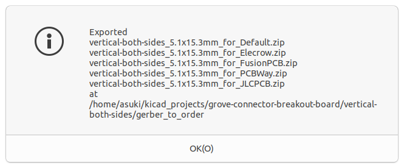

# gerber_to_order

A KiCad plugin to create zip compressed gerber files to order for Elecrow, FusionPCB, PCBWay or JLCPCB.



## Usage

### Setup

Put this project to a directory for plugin.

For Windows.
```
mkdir -p ~/AppData/Roaming/kicad/scripting/plugins
cd ~/AppData/Roaming/kicad/scripting/plugins
git clone https://github.com/asukiaaa/gerber_to_order.git
```

For Mac.
```
mkdir -p ~/Library/Preferences/kicad/scripting/plugins
cd ~/Library/Preferences/kicad/scripting/plugins
git clone https://github.com/asukiaaa/gerber_to_order.git
```


For Linux.
```
mkdir -p ~/.kicad/scripting/plugins
cd ~/.kicad/scripting/plugins
git clone https://github.com/asukiaaa/gerber_to_order.git
```

### Run

Then start pcbnew of KiCad and select Tools -> External plugins -> Gerber to Order.

### Update

Put this project to a directory for plugin.

For Windows.
```
cd ~/AppData/Roaming/kicad/scripting/plugins/gerber_to_order
git pull origin master
```

For Mac.
```
cd ~/Library/Preferences/kicad/scripting/plugins/gerber_to_order
git pull origin master
```


For Linux.
```
cd ~/.kicad/scripting/plugins/gerber_to_order
git pull origin master
```

## Supported manufacturers

Name | Information url
---- | ----
Elecrow | [Elecrow PCB Manufacturing](https://www.elecrow.com/pcb-manufacturing.html)
PCBWay | [Generate Gerber from KiCad 5.1.6](https://www.pcbway.com/blog/help_center/Generate_Gerber_file_from_Kicad_5_1_6.html)
FusionPCB | [Service for Fusion PCB](https://wiki.seeedstudio.com/Service_for_Fusion_PCB)
JLCPCB | [How to generate the Gerber files?](https://support.jlcpcb.com/article/22-how-to-generate-the-gerber-files)</br>[Suggested Naming Patterns](https://support.jlcpcb.com/article/29-suggested-naming-patterns)

## License

MIT

## References

- [Python Plugin Development for Pcbnew](https://kicad.readthedocs.io/en/latest/Documentation/development/pcbnew-plugins/)
- [KiCad Pcbnew Python Scripting: pcbnew Namespace Reference](https://docs.kicad.org/doxygen-python/namespacepcbnew.html)
- [KiCad アクションスクリプト GerberZip](https://www.g200kg.com/archives/2019/05/kicad-gerberzip.html)
- [kicad-action-plugins/action_menu_gerber_zip.py](https://github.com/g200kg/kicad-action-plugins/blob/master/action_menu_gerber_zip.py)
- [PCB製造サービス向けのガーバーデータとzipを作るKiCadのプラグインを作ってみた](https://asukiaaa.blogspot.com/2019/07/pcbzipkicad.html)
- [KiCadの基板の大きさをpythonで測る](https://asukiaaa.blogspot.com/2021/02/kicadpython.html)
- [KiCad 5.1 python_scripts_examples](https://gitlab.com/kicad/code/kicad/-/tree/5.1/demos/python_scripts_examples)
